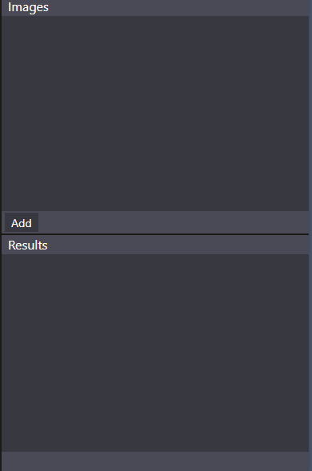

# Vixorcrypt
Vixorcrypt is a xor based visual cryptography implementation. Under the hood it uses bitwise xor operations on each pixel's RGBA channel. All logic was made for pure client side computations. Nothing will be sent to server for any kind of computation or storage.

### For users
This is the place where all coding of this project happens. Website hosting this site located [here](https://vixorcrypt.tebafaz.com). And manual is [here](#manual). Any bugs that may arise while using this project can be written [here](https://github.com/tebafaz/vixorcrypt/issues).

### For developers
Feel free to fork this project and add pull requests!

## Quick start

### Encryption
Make sure that you are in encryption mode

1. Click on the `Add` button in the `Images` section and choose images that needs to be encrypted.

2. Press `Fill` to create shares in `Shares` section.

3. To encrypt each image at least **2** shares are needed. So if you uploaded **3** images, then you need **at least 6** shares to encrypt all the images. Alternatively you can create a lot more(for example 30) shares.

4. Near the top right corner you will see ***green*** play button. It lets you choose image and shares to make a resulting *shares to image* combination. If cross on ***red*** background appears, you can choose multiple shares and one image.

5. After you chose image and shares, you will see ***cyan*** confirm button. If you want picked shares to form chosen image after merging, then press that cyan button. 

6. At the `Results` section you will see what shares form what image after merging.

7. If you want to add more encrypted images, just repeat 4-6 points. If you are satisfied with every `Result`, then you can export this project. In the top left corner press `File` -> `Export as` to download zip file containing all shares that are used in results.

8. Done

### Decryption
Make sure that you are in decryption mode

1. Click on the `Add` button in the `Shares` section and choose images that needs to be decrypted.

2. Near the top right corner you will see ***green play button***. It lets you choose shares that merge among themselves. If cross on ***red*** background appears, you can choose more than **1** shares.

4. After you chose shares, you will see ***cyan confirming button***. Note that canvas chages alongside chosen share. If you want to save image on the canvas, then press that cyan button.

5. At the `Results` section you will see image on the canvas stored.

6. If you want to decrypt more shares, just repeat 2-4 points. If you want to download all images in `Result` section, then you can export this project. In the top left corner press `File` -> `Export as` to download zip file containing all images in `Result` section.

7. Done

## Manual

### Encryption

#### Menubar

Contains additional operations regarding current project

1. `Files` -> `Create project` - creates project, creates canvas and activates all buttons.
2. `Files` -> `Clear project` - clears project, removes canvas, shares, images, results and deactivates buttons.
3. `Files` -> `Export as` - creates `shares.zip` file containing all results  (shares to image set)
4. `Edit` -> `Canvas size` - changes currently shown canvas size to user specified size
5. `About` -> `Help` -> `Docs` - is a link to the docs
6. `About` -> `Github page` - github page

#### Canvas

When project has not been initialized, or has been cleared, canvas will hold just logo. When project initialized, canvas will be created with black background and white border. In state of encrypting, when image was chosen, canvas will show that image. Image is draggable. When exited from state of encrypting, it will show black background again. Result is created based on was is shown in the canvas. It also can resize.

#### Mode bar

Changes current mode to encryption or decryption. 

#### Controller button

Based on the color of a button it does several things

1. `Green play button` - changes to *encrypting* state. In this state user is able to choose which shares have to show image as a result of decryption.
2. `Red cross button` - returns to state before *encrypting* without creating resulting set.
3. `Cyan confirmation button` - confirms chosen shares and image to be a part of a result.

#### Right sidebar

1. `Shares` section shows what shares can be used and what shares are used already.

`Fill` button is used to fill the shares section with amount that is necessary for user. Although it can be added later down the line. Don't bother if you added a lot of shares and didn't use them. Not used shares won't be generated.

2. `Images` contain all necessary images added by user. 

`Add` button will add images. It has side effect of creating canvas with max width and max height from the given images. And it does it only on the first upload.

3. `Results` show the resulting image and shares that need to be merged to resolve encrypted image.

`Remove` button in each section will just remove picked elements in corresponding sections.

#### Lower bar

Shows additional data: *canvas size*, *loading state*

### Decryption

#### Menubar

Contains additional operations regarding current project

1. `Files` -> `Create project` - unavailable due to canvas size limitations.
2. `Files` -> `Clear project` - clears project, removes canvas, shares, results and deactivates buttons.
3. `Files` -> `Export as` - creates `decryptionResults.zip` file containing all results (decrypted images)
4. `Edit` -> `Canvas size` - unavailable due to canvas size limitations.
5. `About` -> `Help` -> `Docs` - is a link to the docs
6. `About` -> `Github page` - github page

#### Canvas

When project has not been initialized, or has been cleared, canvas will hold just logo. When project initialized, canvas will be created with black background and white border. In state of decrypting, when share was picked, canvas will show that image. After picking next ones, canvas' image will show **bitwise pixel xored** image. When exited from state of encrypting, it will show black background again. Result is created based on was is shown in the canvas.

#### Mode bar

Changes current mode to encryption or decryption. 

#### Controller button

Based on the color of a button it does several things

1. `Green play button` - changes to *decrypting* state. In this state user is able to choose shares that are going to be xored.

2. `Red cross button` - returns to state before *decrypting* without creating resulting image.

3. `Cyan confirmation button` - saves the image on canvas into resulting images.

#### Right sidebar

1. `Shares` section shows what shares can be used and what shares are used already.

`Add` button will add shares. It has side effect of creating canvas with width and height from any of the given images. All shares have to be the same length

3. `Results` show the resulting images.

`Remove` button in each section will just remove picked elements in corresponding sections.

#### Lower bar

Shows additional data: *canvas size*, *loading state*
